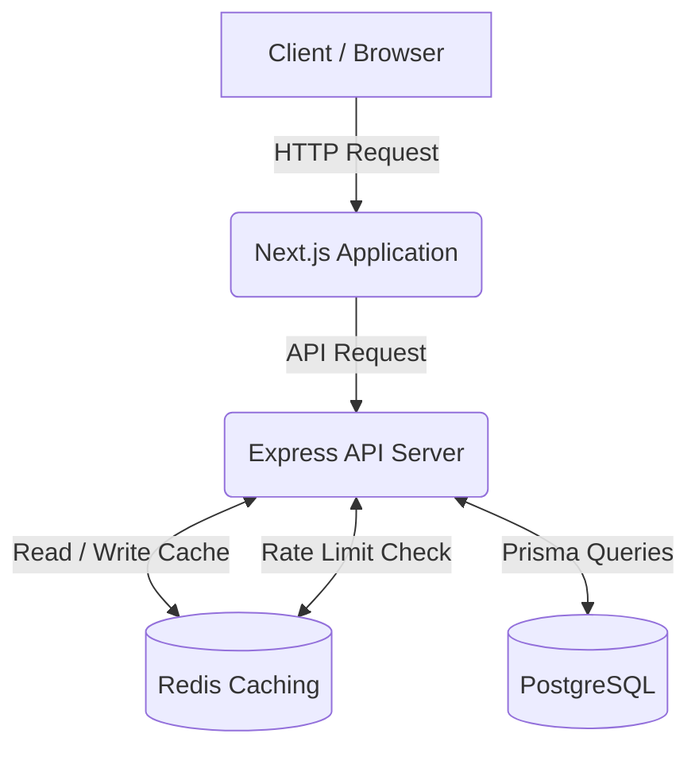
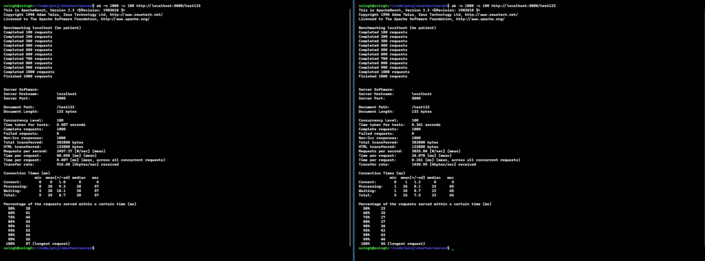

# URL Shortener

## Description

A fast and efficient full-stack URL shortening service that allows users to create short links, track click analytics, and generate QR codes for their customized URLs.

## Tech Stack

- **Frontend**: Next.js (React), Tailwind CSS
- **Backend / API**: Node.js, Express, TypeScript
- **Database**: PostgreSQL with Prisma ORM
- **Caching & Infrastructure**: Redis
- **Utilities**: `nanoid` (for short ID generation), `qrcode` (for QR code generation)

## Features

- **URL Shortening**: Convert long, complex URLs into concise, manageable links.
- **Fast Generation**: Instantly generates unique short IDs using `nanoid`.
- **Analytics & Tracking**: Records detailed click logs including IP address, user agent, and timestamp.
- **QR Codes**: Automatically creates and serves downloadable QR codes for every shortened URL.
- **High Performance Caching**: Uses a Redis caching layer to drastically improve read response times for repeatedly accessed URLs.
- **Rate Limiting** _(Coming Soon)_: Network protection against abuse and spam via Redis-backed request rate limits.

## Architecture

## Performance Benchmarks

Load testing was conducted on the URL redirection route using ApacheBench (`ab`) with 1000 total requests at a concurrency level of 100.

### Cache Miss vs. Cache Hit

The data below clearly highlights the performance benefits provided by the Redis caching layer:

| Metric                  | Cache Miss      | Cache Hit       | Improvement                |
| :---------------------- | :-------------- | :-------------- | :------------------------- |
| **Concurrency Level**   | 100             | 100             | -                          |
| **Total Requests**      | 1000            | 1000            | -                          |
| **Total Time Taken**    | 0.402 seconds   | 0.261 seconds   | **~35% Faster**            |
| **Requests Per Second** | 2487.37 [#/sec] | 3835.81 [#/sec] | **~54% Higher Throughput** |
| **Time Per Request**    | 40.096 [ms]     | 26.070 [ms]     | **~35% Less Latency**      |

**Cache Miss**&nbsp;&nbsp;&nbsp;&nbsp;&nbsp;&nbsp;&nbsp;&nbsp;&nbsp;&nbsp;&nbsp;&nbsp;&nbsp;&nbsp;&nbsp;&nbsp;&nbsp;&nbsp;&nbsp;&nbsp;&nbsp;&nbsp;&nbsp;&nbsp;&nbsp;&nbsp;&nbsp;&nbsp;&nbsp;&nbsp;&nbsp;&nbsp;&nbsp;&nbsp;&nbsp;&nbsp;&nbsp;&nbsp;&nbsp;&nbsp;&nbsp;&nbsp;&nbsp;&nbsp;&nbsp;&nbsp;&nbsp;&nbsp;&nbsp;&nbsp;&nbsp;&nbsp;&nbsp;&nbsp;&nbsp;&nbsp;&nbsp;&nbsp;&nbsp;&nbsp;&nbsp;&nbsp;&nbsp;&nbsp;&nbsp;&nbsp;&nbsp;&nbsp;&nbsp;&nbsp;&nbsp;&nbsp;&nbsp;&nbsp;&nbsp;&nbsp;&nbsp;&nbsp;&nbsp;&nbsp;**Cache Hit**

## Upcoming Implementations

- **Rate limiting** logic using `rate-limit-redis` will be added next to securely gate the API routes from potential spam or DDoS attacks.
